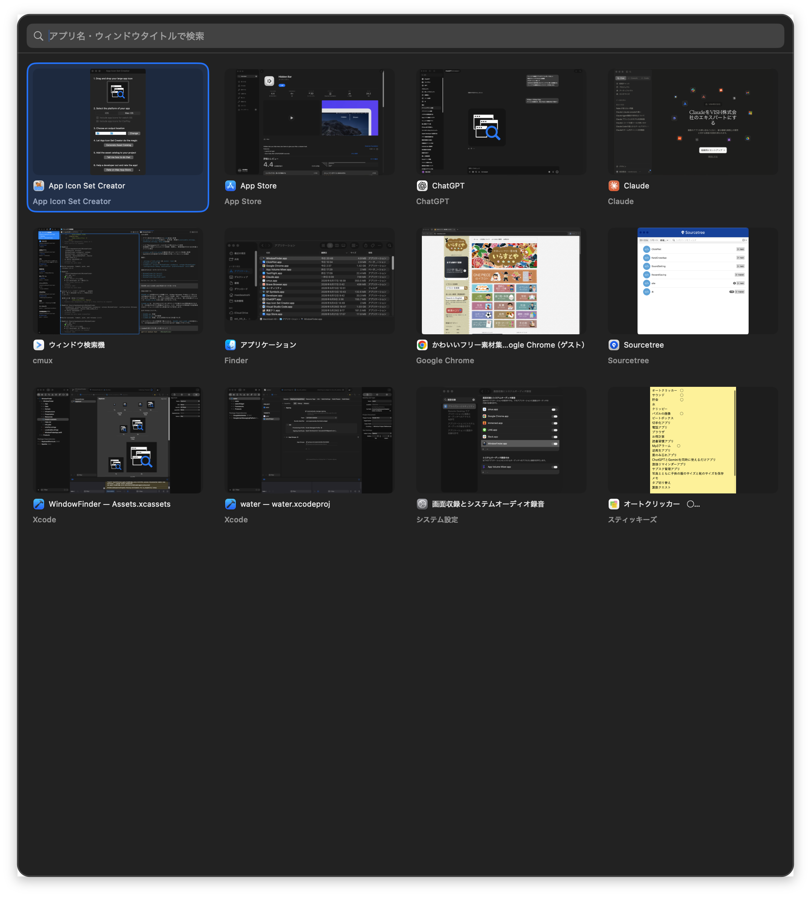

# リモート会議中にウィンドウを見失うので、見た目で選べるmacOSアプリを作った

リモート会議中に画面共有していると、目的のウィンドウがどこかへ行くことがあります。

資料を開いて、ブラウザを開いて、エディタを開いて、チャットを開いて、気づいたら「あのウィンドウどこだっけ？」となる。画面共有中だと、その探している数秒が地味に気になります。

macOSにはMission ControlやCommand-Tabがあります。ショートカットを工夫して切り替えることもできます。ただ、ウィンドウが多いと「見た目で目的のウィンドウを選ぶ」までに少しもたつくことがありました。

そこで、開いているウィンドウをサムネイルで一覧表示して、見た目で選んで呼び出せるアプリを作りました。

## 作ったもの

**Window Finder** というmacOS用ユーティリティです。

開いているウィンドウを一覧から選んで、すばやく前面に呼び出すためのアプリです。

画面中央にウィンドウ一覧を表示し、サムネイルを見ながら目的のウィンドウを選べます。キーボードでもマウスでも操作でき、選んだウィンドウは最小化されていても復元して前面に呼び出します。

## できること

- 開いているウィンドウをサムネイル付きで一覧表示
- アプリ名やウィンドウタイトルで検索
- 矢印キーで選択し、Enterで呼び出し
- マウスクリックでウィンドウを呼び出し
- 最小化中のウィンドウを復元して前面に表示
- グローバルショートカットでいつでも表示
- 表示順、サムネイルサイズ、列数、高さ、自動スクロールを設定

## 使い方

基本操作はシンプルです。

1. **⌃⌥Space** を押してWindow Finderを表示します。
2. 一覧から呼び出したいウィンドウを選びます。
3. **Enter** またはクリックで、そのウィンドウを前面に呼び出します。

表示中にもう一度 **⌃⌥Space** を押すと、ウィンドウ一覧を更新します。閉じるときは **Esc** を押します。

| 操作 | 内容 |
| --- | --- |
| **⌃⌥Space** | Window Finderを表示、表示中は一覧を更新 |
| **↑ ↓ ← →** | ウィンドウを選択 |
| **Enter** | 選択中のウィンドウを呼び出す |
| **Esc** | 閉じる |

既定のショートカットは **⌃⌥Space** です。設定画面から別のキー組み合わせにも変更できます。

検索欄に入力すると、アプリ名またはウィンドウタイトルで絞り込めます。候補の先頭が自動で選択されるので、文字を入力してEnterを押すだけで目的のウィンドウに移動できます。

## なぜ作ったか

リモート会議中の画面共有では、ウィンドウ切り替えの迷いがそのまま相手にも見えます。

Command-Tabはアプリ単位の切り替えには便利ですが、同じアプリ内に複数ウィンドウがあると目的のものへ一発で行きにくいです。Mission Controlも便利ですが、画面全体のモードが切り替わる感覚があり、会議中に何度も使うには少し大げさに感じることがありました。

欲しかったのは、ランチャーのようにすぐ出て、今開いているウィンドウを見た目で選べるものです。

ウィンドウをきれいに並べたいわけではなく、どこかへ行ったウィンドウをすぐ探して呼び戻したい。そこに絞ったアプリにしました。

## 実装で考えたこと

実装はSwift / SwiftUI + AppKitです。

ウィンドウの一覧取得や前面化にはAccessibility APIを使っています。サムネイルの取得にはScreenCaptureKitを使っています。

大まかには以下のような構成です。

- Accessibility APIで各アプリのウィンドウ一覧を取得する
- ScreenCaptureKitでウィンドウのサムネイルを取得する
- SwiftUIでサムネイルのグリッドを表示する
- AppKitの`NSPanel`で画面中央にHUDっぽく出す
- KeyboardShortcutsでグローバルショートカットを扱う

サムネイル表示には画面収録権限が必要です。未許可の場合はアプリアイコンで代替します。

ウィンドウを前面に呼び出すときは、最小化されていれば解除し、対象ウィンドウをraiseして、所有アプリをアクティブにしています。

## Mac App StoreではなくDMG配布にした

最初はMac App Storeで配布することも考えていました。

ただ、このアプリは他のアプリのウィンドウ一覧を取得したり、選択したウィンドウを前面に呼び出したりします。そのためAccessibility権限が必須になります。

さらに、他アプリのウィンドウを操作する都合上、App Sandboxとの相性がかなり厳しいです。

結果として、Mac App StoreではなくDeveloper ID署名と公証済みDMGで配布する形にしました。

配布まわりは、署名、DMG作成、公証、ステープル、appcast更新、GitHub Releasesへのアップロードまでをスクリプトでまとめています。自動アップデートにはSparkleを使っています。

## BMCも用意した

せっかく公開するので、Buy Me a Coffeeも登録して支援ページを用意しました。

必須の課金ではなく、もし役に立ったら支援してもらえる導線として置いています。

## ClaudeとCodexで作った

実装はClaudeとCodexを使いながら進めました。

設計の整理、実装、READMEの整備、ローカライズ、配布まわりの修正などを、AIとやり取りしながら詰めています。

とはいえ、何を作りたいか、どの体験を優先するか、Mac App StoreではなくDMG配布にするか、といった判断は人間側で決めています。

AIにコードを書かせるというより、実装の相談相手と作業者を兼ねてもらう感覚でした。

## まとめ

小さな不便でも、毎日の作業や会議中に何度も起きると意外と効いてきます。

今回は「ウィンドウを探す時間を減らす」ことだけに絞ったので、機能としてはシンプルですが、自分の作業ではかなり使いやすくなりました。

macOSアプリは権限や配布まわりで考えることが多かったものの、Accessibility APIやScreenCaptureKitを使うことで、欲しかった体験にかなり近づけられたと思います。

同じようにウィンドウを見失いがちな人の参考になれば嬉しいです。
